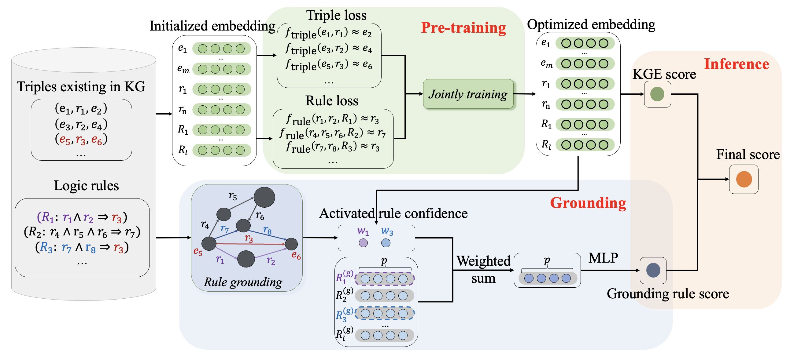

# RulE: Neural-Symbolic Knowledge Graph Reasoning with Rule Embedding

This is an implementation of the [RulE]() model for knowledge graph reasoning. **RulE** is a novel and principled framework to represent and model logical rules and triplets. It jointly represents entities, relations and logical rules in a unified embedding space. By learning rule embeddings, it can improve the generalization capability of KGE and improve logical rule reasoning. 

## Overview 

This is the overall architecture of RulE, consisting of three components: pre-training, grounding, inference.
## Datasets
Datasets used are contained in the folder ```data/```. The format is as follows:

train.txt, valid.txt, test.txt: training, valid, test set with triplets; Format: (h,r,t).

mined_rules.txt: These rules are mined by RNNLogic. Format: [rule_head, rule_body_list]. For example, $r_1 \land r_2 \rightarrow r_3$ can be represented as $[r_3,r_1,r_2]$


## Installation
First clone the repository, then install the package dependency in the `requirement.txt` with the following command:
```
conda create -n RulE python=3.8.0
pip install -r requirement.txt
```

## Usage 
The folder ```config/``` contain the configuration file of each dataset and the folder ```src/``` provides the implementation of RulE.  You can edit the config file and enter the folder ```src/``` to excute the following command:

```
python main.py --init ../config/umls_config.json
```
## Results 
Using the default configuration files, we can achieve the results reported on paper. 

<!-- 
## Citation
Please consider citing the following paper if you find our codes helpful. Thank you!
```

``` -->


